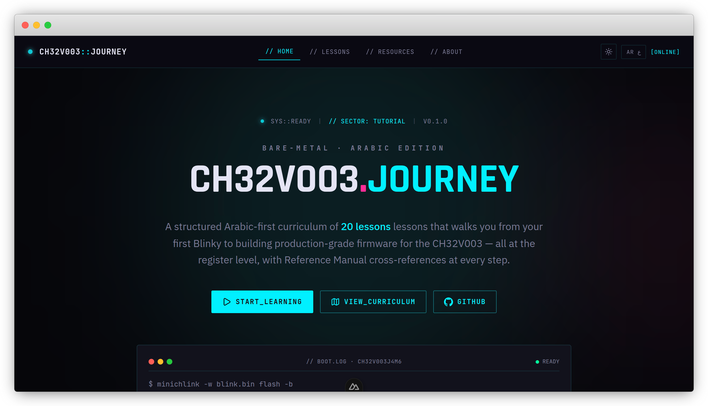

# CH32V003 Journey

> Arabic-first bare-metal RISC-V curriculum for the WCH **CH32V003J4M6**.
> Live at **[ch32v003.shakir.sd](https://ch32v003.shakir.sd)**.

A structured, 22-lesson journey from your first Blinky to building production-grade firmware on a 30-cent RISC-V chip — written at the register level, with **CH32V003 Reference Manual v1.9** cross-references on every page.



## Why this exists

Most bare-metal learning material is English-only and assumes an STM32/ARM background. The CH32V003 is dirt-cheap (sub-$0.50), RISC-V, and underrepresented in Arabic learning resources. This curriculum closes that gap.

## What's inside

| Track | Lessons |
|-------|---------|
| **Foundation** | Curriculum overview, bitwise magic, registers intro, GPIO output |
| **Core I/O** | GPIO input + EXTI, clock system, SysTick, NVIC/PFIC, Timers + PWM |
| **Comms** | UART (deep), SPI master, I2C + SSD1306 OLED |
| **Analog** | ADC, DMA |
| **Pro** | Low-power modes, Watchdog (IWDG/WWDG), Flash programming + EEPROM emulation, Linker + Startup, Debugging |
| **Capstone** | Final project — 5×5 LED matrix with UART control |

## Stack

- **Nuxt 4** + **@nuxt/content v3** for content
- **Nuxt UI Pro** + **Tailwind 4** for styling
- **@nuxtjs/i18n** — Arabic (RTL, default) + English (LTR)
- **Cyberpunk** design system (dark HUD aesthetic, neon accents)
- Markdown lessons stored in `content/lessons/*.md`

## Development

```bash
pnpm install
pnpm dev          # http://localhost:3000
pnpm build        # production
pnpm preview      # preview the build
```

Node 18+ required.

## Project layout

```
app/
  components/    # AppHeader, AppFooter, Logo
  pages/         # index, lessons/*, about, resources
  layouts/       # default cyberpunk layout
  assets/main.css # cyberpunk design tokens
content/
  lessons/       # 22 markdown lessons (L00..L21)
i18n/locales/    # en.json, ar.json
public/
  hardware/      # WCH-LinkE + chip images
  robots.txt
server/
  routes/        # sitemap.xml endpoint
```

## Author

**Shakir Abdo** — full-stack developer from Sudan, interested in embedded systems and low-level tooling.

- **GitHub**: [@shakir-abdo](https://github.com/shakir-abdo)
- **X**: [@shakir_abdoo](https://x.com/shakir_abdoo)
- **Telegram**: [@shakir_abdo](https://t.me/shakir_abdo)
- **Website**: [shakir.sd](https://shakir.sd)
- **Support**: [PayPal](https://paypal.me/shicolare1)

### Related projects

- [`ch32v003j4m6-libraries`](https://github.com/shakir-abdo/ch32v003j4m6-libraries) — register-level libraries for GPIO, ADXL345, MPU6050, AHT10, MLX90614, AS5600, Servo, WS2812B, Buzzer, AT24C32, internal-EEPROM, deep-sleep, rotary encoder.
- [`ch32v003-unbrick`](https://github.com/shakir-abdo/ch32v003-unbrick) — CLI tool to recover a bricked CH32V003 via WCH-LinkE.

## Contributing

Issues + PRs welcome. Typo fixes, lesson improvements, English translations of lesson content — all appreciated. Open an issue first for large changes so we can align on direction.

## License

Dual-licensed — code and content under different terms on purpose.

- **Source code** (`app/`, `server/`, `nuxt.config.ts`, build scripts, components, styles): **MIT** — see [LICENSE](LICENSE). Reuse freely in your own projects.
- **Lesson content** (`content/lessons/**`, hardware images, educational copy): **CC BY-NC-SA 4.0** — see [LICENSE-CONTENT](LICENSE-CONTENT).

**Plain English:**
- ✅ Learn from it, contribute, translate, reuse code snippets.
- ✅ Fork it for educational/non-commercial purposes (attribute the source).
- ❌ Don't rebrand and re-upload the curriculum as your own product.
- ❌ Don't bundle the lessons into a paid course or commercial offering.

If you want to do something the license doesn't cover (e.g. include excerpts in a paid book or course), reach out — happy to discuss.

---

*Built register by register. Hope this saves you hours.*
